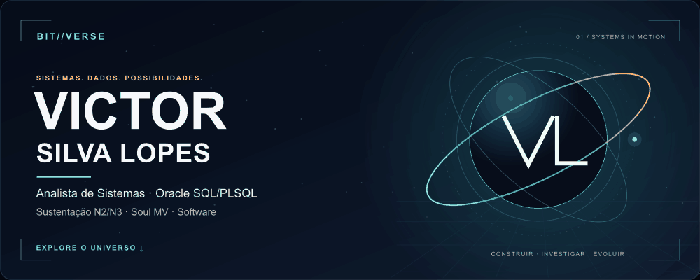
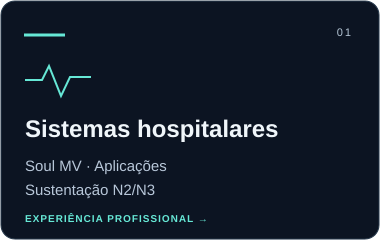
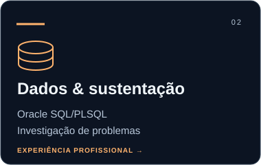
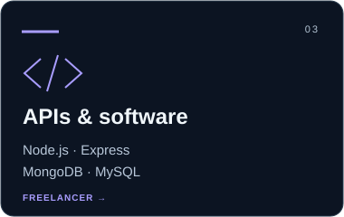
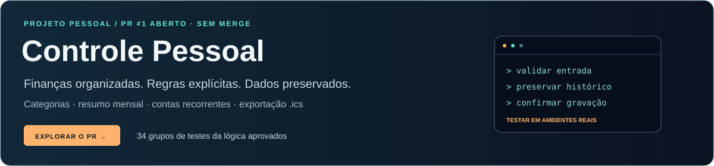

<picture>
  <source media="(prefers-reduced-motion: reduce)" srcset="./assets/bitverse/hero-static.png">
  
</picture>

  <a href="./PROFILE-STATIC.md">◼ Perfil sem animação</a> &nbsp; · &nbsp;
  <a href="https://www.linkedin.com/in/victor-silva-lopes/">↗ LinkedIn</a> &nbsp; · &nbsp;
  <a href="https://github.com/Bitoterror0/controle-pessoal/pull/1">↗ Projeto em revisão</a>

# Sistemas em movimento. Soluções com propósito.

Sou **Victor Silva Lopes**, analista de sistemas em ambiente hospitalar. Trabalho com **Oracle SQL/PLSQL, Soul MV e sustentação N2/N3**. Como freelancer, desenvolvo APIs com **Node.js e Express**. Investigar problemas, preservar dados e construir soluções faz parte do meu trabalho.

### Escolha um caminho

### Um projeto para explorar

**[Ver repositório](https://github.com/Bitoterror0/controle-pessoal) · [Ver alterações no PR #1](https://github.com/Bitoterror0/controle-pessoal/pull/1)**

As melhorias estão em revisão, sem merge. Leitores de tela, voz em dispositivos reais, agendas externas e serviço remoto real ainda precisam de validação. O `.ics` é uma cópia para a agenda; pagamentos no app não sincronizam com ela.

### Sistemas hospitalares

Soul MV, atendimento N2/N3 e apoio aos módulos utilizados pelas equipes. Servidores, redes e backups no contexto da sustentação de sistemas.

### Dados e sustentação

Oracle SQL/PLSQL na investigação e no suporte a aplicações. MySQL e MongoDB em projetos de desenvolvimento.

### APIs e software

APIs com Node.js e Express. **Em desenvolvimento:** sistema para clínicas com React e PostgreSQL.

<strong>Formação, objetivos e English overview</strong>

#### Formação

- **UNINOVE:** bacharelado em Sistemas de Informação — em andamento.
- **PUCPR:** pós-graduação em Desenvolvimento de Software — em andamento; término previsto em janeiro de 2027.
- **Anhembi Morumbi:** tecnólogo em Segurança da Informação — concluído.
- **CS50x:** estudos pelo curso online; sem certificado.

Busco oportunidades em análise e sustentação de sistemas e desenvolvimento, em **bancos, organizações de saúde e empresas internacionais**. Aceito remoto a partir do Brasil e avalio híbrido conforme a localização, em CLT ou PJ. Meu inglês é intermediário e estou aprimorando a comunicação em entrevistas técnicas.

#### English overview

Systems Analyst with experience in hospital applications, Oracle SQL/PLSQL, Soul MV and N2/N3 application support. My freelance work includes Node.js/Express APIs with MongoDB and MySQL. A clinic management project using React and PostgreSQL is in development. Open to systems support and development opportunities with banks, healthcare organizations and international companies, including remote work from Brazil. Intermediate English.

---

**BIT//VERSE** — identidade visual original criada com Codex e Claude. Animação decorativa, sem flashes ou áudio. As especialidades são experiências reais, sem níveis ou pontuações inventados.
